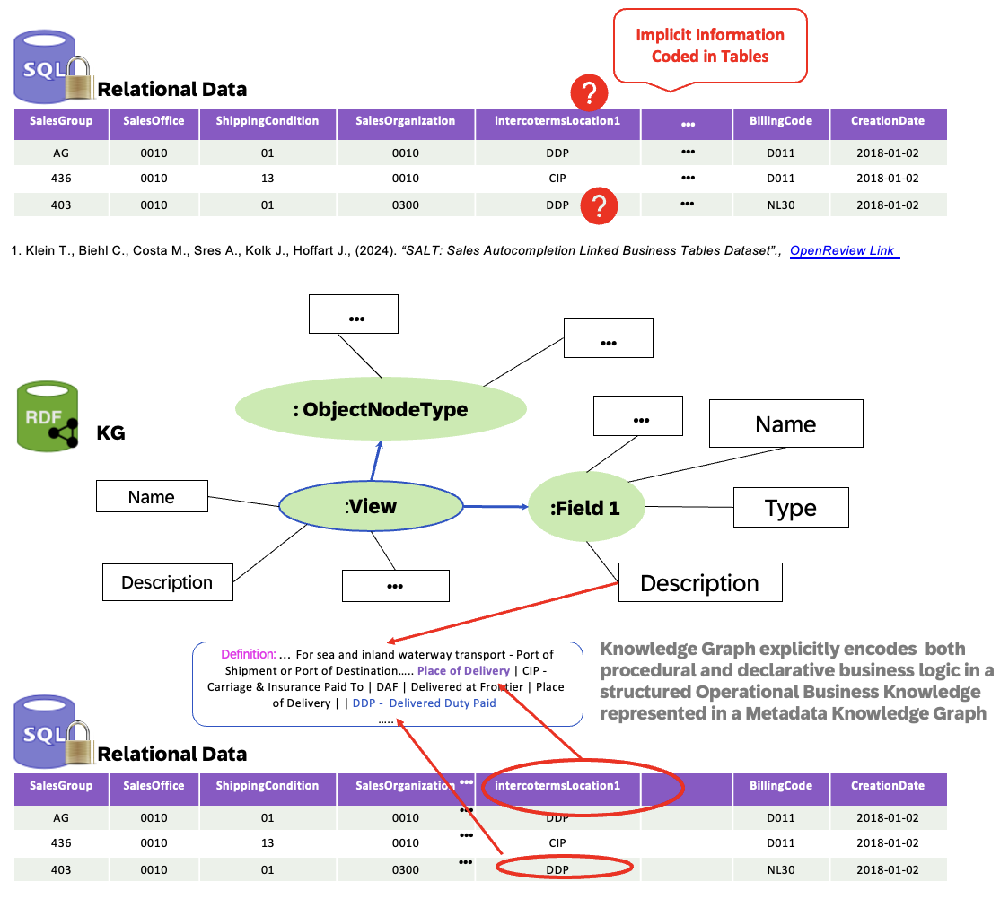

# SALT-KG: A Benchmark for Semantics-Aware Learning on Enterprise Tables

<!--- Register repository https://api.reuse.software/register, then add REUSE badge:

-->

## Description

This repository contains the dataset from our paper SALT-KG: A Benchmark for Semantics-Aware Learning on Enterprise Tables, presented at EurIPS'25 Table Representation Workshop.

## Abstract
Building upon the SALT benchmark for relational prediction, we introduce SALT-KG, a benchmark for semantics-aware learning on enterprise 
tables. SALT-KG extends SALT by linking its multi-table transactional data with a structured Operational Business Knowledge represented in a Metadata Knowledge
Graph (OBKG) that captures field-level descriptions, relational dependencies, and business object-types. This extension enables evaluation of models that jointly reason over tabular evidence and contextual semantics—an increasingly critical capability for foundation models on structured data. Empirical analysis reveals that while metadata-derived features yield modest improvements in classical prediction metrics, these metadata features consistently highlight gaps in models’ ability to leverage semantics in relational context. By reframing tabular prediction as semantics-conditioned reasoning, SALT-KG establishes a benchmark to advance tabular FMs grounded in declarative knowledge, providing the first empirical step toward semantically linked tables in structured data at enterprise scale.

## Why SALT-KG

## Download and Installation

## Known Issues
<!-- You may simply state "No known issues. -->

## How to obtain support
[Create an issue](https://github.com/SAP-samples/<repository-name>/issues) in this repository if you find a bug or have questions about the content.
 
For additional support, [ask a question in SAP Community](https://answers.sap.com/questions/ask.html).

## Contributing
If you wish to contribute code, offer fixes or improvements, please send a pull request. Due to legal reasons, contributors will be asked to accept a DCO when they create the first pull request to this project. This happens in an automated fashion during the submission process. SAP uses [the standard DCO text of the Linux Foundation](https://developercertificate.org/).

## License
Copyright (c) 2025 SAP SE or an SAP affiliate company. All rights reserved. This project is licensed under the CC-BY-NC-SA-4.0 except as noted otherwise in the [LICENSE](LICENSE) file.
